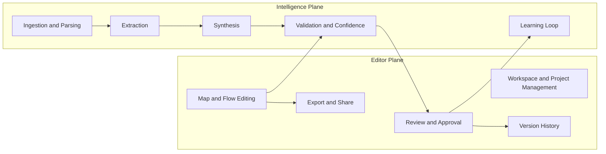
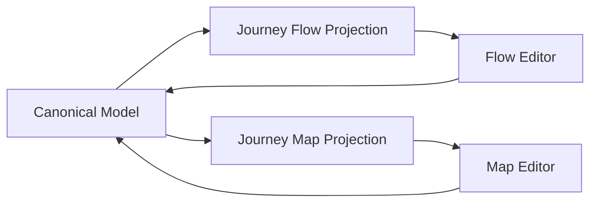
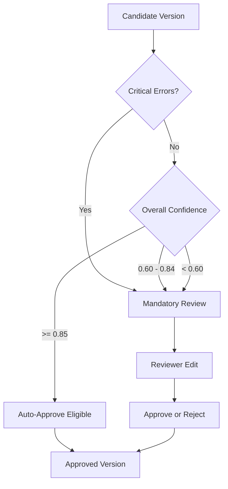

# Intelligent Automated Document Import and Journey Flow Conversion

Version: v1.1  
Status: Draft  
Owner: Workflow Designer

---

## 1) Purpose

Define the target product and architecture for converting documents and raw text into editable user journey maps and process flows, with confidence scoring, human review, and production-ready export workflows.

This revision (v1.1) expands scope from pipeline-only to **product + pipeline** and aligns with implementation realities (projects, folders, import modes, exports, and review operations).

---

## 2) Problem Statement

Teams store process knowledge in unstructured sources (PDF, DOCX, text notes, emails). Converting this into structured journey maps and process flows is manual, inconsistent, and slow.

We need a system that:

- Supports both manual-first and AI-assisted mapping
- Ingests heterogeneous sources
- Extracts actions, actors, decisions, systems, and exceptions
- Synthesizes a canonical workflow graph
- Scores confidence and validates structure
- Routes uncertain outputs to human review
- Exports production artifacts (JSON, Mermaid, SVG, PNG)
- Learns from accepted edits over time

---

## 3) Design Principles

1. **Canonical schema first** (single source of truth model)
2. **Map + Flow are projections** (never separate source models)
3. **Hybrid intelligence** (deterministic extraction + LLM reasoning)
4. **Confidence-gated automation** (safe defaults over blind auto-publish)
5. **Human-in-the-loop for uncertainty**
6. **Traceability for AI-generated elements**
7. **Safe evolution** (typed contracts, schema versioning, migration-ready)
8. **Product-plane reliability first** (projects, versions, exports, review UX)

---

## 4) Product Scope Model (Editor Plane + Intelligence Plane)



### Rationale

- The product must be useful even when AI import is unavailable.
- Manual editing and review are first-class, not fallback behaviors.
- Pipeline improvements should not break editor and export workflows.

---

## 5) Execution Order (Recommended)

This is the optimized implementation sequence for fastest usable outcomes and lower risk:

1. **Workspace + Editor Core**
   - Projects/folders/map artifacts/versioning
   - Manual map/flow editing
   - JSON export/import baseline
2. **Import Modes**
   - Text import
   - AI-assisted text-to-flow
3. **Review + Approval**
   - Validation panel
   - Candidate review state transitions
4. **Document Ingestion**
   - PDF/DOCX parse + extraction + synthesis
   - Evidence links for AI-generated elements
5. **Dual-view Projection**
   - Journey Map and Journey Flow tabs from same model
6. **Production Hardening**
   - Observability, launch QA matrix, policy controls

---

## 6) Import Modes (Operational)

| Mode | Input | Output | Confidence Path | Notes |
|---|---|---|---|---|
| Manual | user edits | canonical graph | N/A | fastest and most reliable for early adoption |
| Text Import | pasted text | candidate graph | required | low-friction entry point |
| Doc Import | PDF/DOCX | candidate graph + evidence | required | parsing variability expected |
| AI Assist | prompt + context | candidate graph | required | must be review-gated by policy |

---

## 7) Canonical Data Model (v1.1)

### 7.1 Core Workspace Entities

```ts
type Workspace = {
  id: string;
  name: string;
  createdAt: string;
};

type Project = {
  id: string;
  workspaceId: string;
  folderId?: string;
  name: string;
  description?: string;
  createdAt: string;
  updatedAt: string;
};

type Folder = {
  id: string;
  workspaceId: string;
  name: string;
};
```

### 7.2 Map Artifact and Versioning

```ts
type MapArtifact = {
  id: string;
  projectId: string;
  name: string;
  currentVersionId: string;
  currentApprovedVersionId?: string;
  createdAt: string;
  updatedAt: string;
};

type MapVersion = {
  id: string;
  artifactId: string;
  schemaVersion: "1.1";
  data: CanonicalModel;
  reviewState: "draft" | "in_review" | "approved" | "rejected";
  createdBy: string;
  createdAt: string;
};
```

### 7.3 Canonical Model + Projections

```ts
type CanonicalModel = {
  id: string;
  title: string;
  sourceDocs: SourceDocRef[];
  nodes: Node[];
  edges: Edge[];
  confidence: ConfidenceSummary;
  validation: ValidationResult[];
  projections: {
    flow: ViewLayout;
    map: ViewLayout;
  };
};

type ViewLayout = {
  nodePositions: Record<string, { x: number; y: number }>;
  groups?: Array<{ id: string; label: string; nodeIds: string[] }>;
};
```

### 7.4 Nodes, Edges, Evidence

```ts
type Node = {
  id: string;
  type: "terminal" | "process" | "decision" | "data" | "annotation";
  label: string;
  actor?: "customer" | "agent" | "system" | "manager" | "external";
  status?: "live" | "planned" | "deprecated";
  metadata?: {
    system?: string;
    sla?: string;
    aht?: string;
    volume?: string;
    notes?: string;
    // map-oriented optional metadata
    stage?: string;
    touchpoint?: string;
    emotion?: number; // e.g. -3..+3
  };
  evidence?: EvidenceRef[]; // required for AI-imported nodes, optional for manual nodes
  confidence?: number; // 0..1 for AI-imported nodes
  origin: "manual" | "text_import" | "doc_import" | "ai_assist";
};

type Edge = {
  id: string;
  from: string;
  to: string;
  type: "sequential" | "conditional" | "parallel" | "fallback";
  label?: string;
  evidence?: EvidenceRef[]; // required for AI-imported edges
  confidence?: number; // 0..1 for AI-imported edges
  origin: "manual" | "text_import" | "doc_import" | "ai_assist";
};

type SourceDocRef = {
  docId: string;
  name: string;
  type: "pdf" | "docx" | "pptx" | "txt" | "email" | "csv" | "bpmn";
  version?: string;
};

type EvidenceRef = {
  docId: string;
  chunkId: string;
  quote?: string;
  page?: number;
  section?: string;
};
```

### 7.5 Confidence + Validation

```ts
type ConfidenceSummary = {
  overall: number; // 0..1
  extraction: number;
  synthesis: number;
  validationPenalty: number;
};

type ValidationResult = {
  code:
    | "NO_TERMINAL"
    | "DECISION_NEEDS_EXITS"
    | "ISOLATED_NODE"
    | "UNLABELED_CONDITIONAL"
    | "CYCLE_WARNING"
    | "MISSING_EVIDENCE_AI_ELEMENT";
  severity: "info" | "warn" | "error";
  message: string;
  targetId?: string;
};
```

---

## 8) Map vs Flow Tabs (Single Model Rule)

Journey Map and Journey Flow are **two projections of the same canonical model**.



### Rules

1. Shared fields (label, actor, status, metadata common fields) update both tabs.
2. View-specific layout data is isolated to `projections.flow` or `projections.map`.
3. No duplicated node/edge identities across tabs.

---

## 9) Confidence and Routing Policy

### 9.1 Confidence Levels

- **High**: overall >= 0.85 and no error validations
- **Medium**: 0.60 to 0.84 or warnings
- **Low**: < 0.60 or critical contradictions

### 9.2 Routing



---

## 10) Security and Key Handling Policy

### 10.1 Preferred

- Provider API keys are stored server-side only.
- Client requests use workspace-scoped backend token.
- No provider key material is returned to browser.

### 10.2 If client-side key entry is temporarily allowed

- Store encrypted at rest in browser storage.
- Never log key values in telemetry or console.
- Provide clear user warning and revocation guidance.
- Mask values in UI and disable accidental export of secrets.

### 10.3 Additional Security Requirements

- Encrypted storage for documents/artifacts
- Access control by workspace/project
- PII-redaction for evidence snippets in logs

---

## 11) Export Contract (v1.1)

Supported formats:

- `json` (round-trip required)
- `mermaid` (high-fidelity structure expected)
- `svg` (visual fidelity expected)
- `png` (rendered snapshot)

```ts
type ExportArtifact = {
  id: string;
  artifactId: string;
  versionId: string;
  format: "json" | "mermaid" | "svg" | "png";
  createdAt: string;
  url: string;
};
```

### Fidelity Notes

- JSON is source of truth and must round-trip with no structural loss.
- Mermaid/SVG/PNG are publish outputs; minor layout differences are acceptable.

---

## 12) API Contract (v1.1)

### 12.1 Workspace and Artifact APIs

- `POST /api/projects`
- `POST /api/projects/{projectId}/artifacts`
- `POST /api/artifacts/{artifactId}/versions`
- `POST /api/artifacts/{artifactId}/export`

### 12.2 Import and Synthesis APIs

- `POST /api/import` (documents/text)
- `POST /api/synthesize` (candidate generation)
- `POST /api/review/{versionId}/approve`
- `POST /api/review/{versionId}/reject`

Request/response payloads use schema version `1.1`.

---

## 13) MVP Scope (Optimized)

### 13.1 In Scope (v1)

- Workspace/project/artifact/version model
- Manual editing (flow-first)
- Journey Flow + Journey Map tabs from one model
- Actor metadata on nodes and optional actor-based filtering
- Text import + AI assist import
- Validation + review lifecycle
- JSON/Mermaid/SVG/PNG export
- Basic observability and launch QA checklist

### 13.2 Out of Scope (v1)

- Full BPMN round-trip parity
- Real-time multi-user collaboration
- Deep process mining analytics
- Broad multilingual domain packs
- Automatic swimlane generation and lane-aware auto-layout

### 13.3 Swimlane Scope Clarification

- **v1**: No mandatory swimlane rendering in process view.  
  Node `actor` is required in schema for future lane logic, filtering, and reporting.
- **v1.1 optional (if capacity allows)**: Manual actor lane grouping toggle in flow projection.
- **post-v1**: Automatic swimlane generation and lane-aware validation/layout.

---

## 14) Quality Gates and Launch Checklist

Use pass/warn/fail ratings per environment and release candidate.

| Gate | Pass Criteria |
|---|---|
| Schema Validity | 100% candidate versions validate against schema 1.1 |
| Validation Engine | Decision exits, terminal reachability, orphan detection verified |
| Confidence Routing | Low-confidence candidates never auto-approve |
| Review Workflow | Draft -> in_review -> approved/rejected transitions reliable |
| Export Fidelity | JSON round-trip lossless; Mermaid/SVG/PNG generation stable |
| Security | No secrets in logs; key handling policy enforced |
| Performance | Editor remains responsive at target map size |
| Observability | Metrics and traces visible for import->approve path |

---

## 15) Non-Functional Requirements

### 15.1 Performance

- Editor interactions remain responsive at expected node/edge volume.
- Import-to-candidate latency is observable and bounded for typical docs.

### 15.2 Reliability

- Idempotent import/synthesis requests via request key.
- Versioned artifacts and auditable review transitions.

### 15.3 Observability

Track:

- parse success rate
- synthesis success rate
- auto-approval rate
- reviewer edit distance
- export success rate by format
- confidence distribution by import mode/source type

---

## 16) Future Enhancements

- BPMN import/export parity
- Process mining from event logs
- Automatic swimlane generation by actor/system
- Domain-specific adapters (support, sales, onboarding, claims)
- Multilingual and locale-aware extraction packs

---

## 17) Chapter-by-Chapter Implementation Plan (Effort + Token Forecast)

This plan uses **implementation cycles** and **relative effort** (S/M/L) rather than calendar dates.
One cycle means code + test + commit/push.

| Chapter | Scope | Effort | Typical Cycles | Token Estimate |
|---|---|---:|---:|---:|
| 1 | Spec finalization + schema lock + glossary | S | 1 | 2k-5k |
| 2 | Workspace model (workspace/project/folder/artifact/version APIs) | M | 2-3 | 10k-18k |
| 3 | Editor core (flow view create/edit/connect/delete/select/history) | L | 4-6 | 24k-40k |
| 4 | Journey Map projection (phases/touchpoints view + shared field sync) | M | 2-4 | 12k-22k |
| 5 | Import modes (manual/text/AI assist entry flows + orchestration hooks) | M | 2-4 | 12k-24k |
| 6 | Synthesis + validation + confidence routing | L | 3-5 | 18k-32k |
| 7 | Review lifecycle (draft/in_review/approved/rejected + reviewer UX) | M | 2-4 | 12k-20k |
| 8 | Export layer (JSON/Mermaid/SVG/PNG + artifact records) | M | 2-4 | 10k-18k |
| 9 | Security/key handling policy implementation + redaction | M | 2-3 | 8k-14k |
| 10 | Observability + QA matrix automation + release gates | M | 2-4 | 10k-18k |
| 11 | Hardening pass (bugfixes, perf tuning, edge-case migrations) | M/L | 3-5 | 15k-30k |

### Total Token Forecast

- **Lean execution (strict scope control):** ~95k-130k  
- **Typical execution:** ~130k-210k  
- **Expanded scope / frequent UX changes:** ~210k-300k+

### Token Optimization Rules

1. Freeze canonical schema early and avoid midstream field churn.
2. Keep map/flow as one model with projection-only differences.
3. Deliver manual + text import before document ingestion complexity.
4. Gate extras (auto-swimlanes, advanced analytics) until post-v1.
5. Use chapter acceptance criteria before moving to next chapter.

