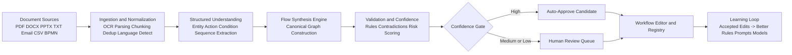
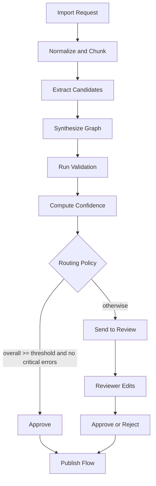
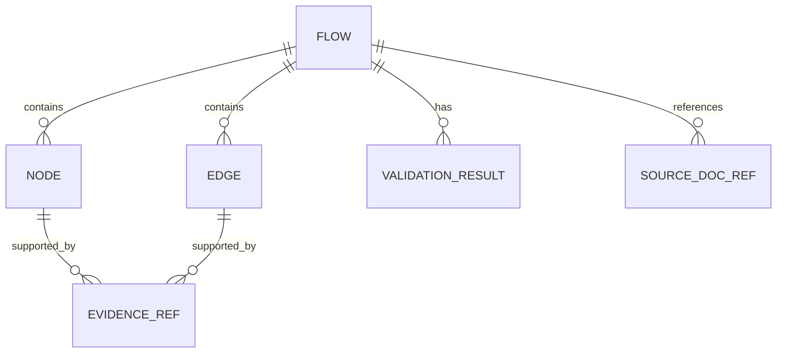
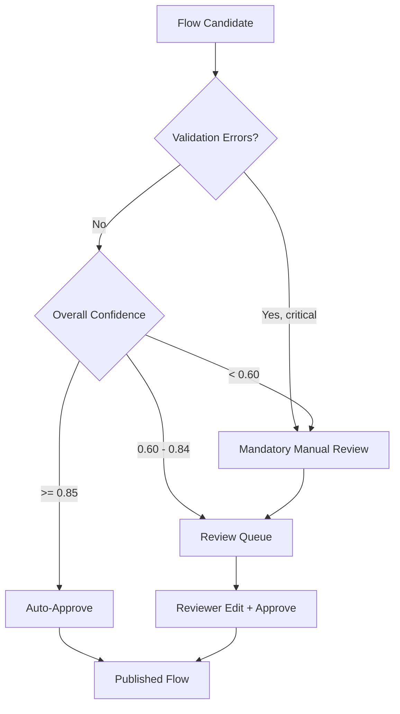
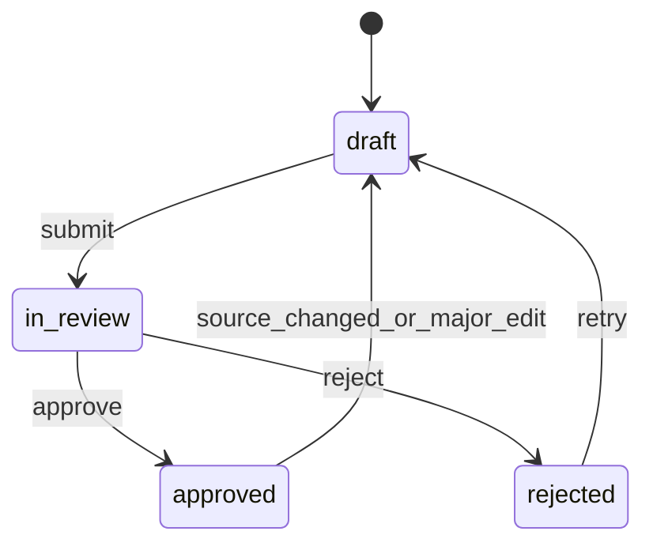

# Intelligent Automated Document Import and Journey Flow Conversion

Version: v1.0  
Status: Draft  
Owner: Workflow Designer

---

## 1) Purpose

Define the target architecture, data contracts, confidence model, and review workflow for an intelligent system that converts business documents into editable user journey maps and process flows.

This specification is implementation-oriented and intended to guide MVP build and scale-out.

---

## 2) Problem Statement

Teams store process knowledge in unstructured sources (PDFs, DOCX, PPTX, emails, internal docs). Converting this into a structured, editable journey map is manual, inconsistent, and slow.

We need a system that:

- Ingests documents from heterogeneous sources
- Extracts actions, actors, decisions, systems, and exceptions
- Synthesizes a canonical workflow graph
- Scores confidence and validates structure
- Routes uncertain outputs to human review
- Learns from accepted edits over time

---

## 3) Design Principles

1. **Canonical schema first** (single model across all source types)
2. **Hybrid intelligence** (deterministic extraction + LLM reasoning)
3. **Confidence-gated automation** (not all outputs auto-publish)
4. **Human-in-the-loop by default for uncertainty**
5. **Traceability** (every node/edge links to evidence)
6. **Safe evolution** (typed contracts, validation, versioning)

---

## 4) High-Level Architecture



---

## 5) End-to-End Pipeline

### 5.1 Pipeline Stages

1. **Ingest**
   - Accept file uploads or source connectors.
   - Normalize format and metadata.
2. **Parse + Chunk**
   - OCR for scanned docs.
   - Layout-aware section splitting.
3. **Extract**
   - Actions (verb-led tasks), actors, systems, conditions, exceptions.
4. **Synthesize**
   - Build nodes and edges in canonical graph format.
5. **Validate**
   - Structural rules (terminals, decision exits, orphan detection).
6. **Score**
   - Node-level, edge-level, and flow-level confidence.
7. **Route**
   - Auto-approve or send to reviewer.
8. **Review + Publish**
   - Human edits and approves.
9. **Learn**
   - Persist corrections as supervised signals.

### 5.2 Flow of Control



---

## 6) Canonical Data Model (v1)

### 6.1 Type Definitions

```ts
type Flow = {
  id: string;
  title: string;
  sourceDocs: SourceDocRef[];
  nodes: Node[];
  edges: Edge[];
  confidence: ConfidenceSummary;
  validation: ValidationResult[];
  reviewState: "draft" | "in_review" | "approved" | "rejected";
  createdAt: string;
  updatedAt: string;
};

type SourceDocRef = {
  docId: string;
  name: string;
  type: "pdf" | "docx" | "pptx" | "txt" | "email" | "csv" | "bpmn";
  version?: string;
};

type Node = {
  id: string;
  type: "terminal" | "process" | "decision" | "data" | "annotation";
  label: string;
  actor?: "customer" | "agent" | "system" | "manager" | "external";
  status?: "live" | "planned" | "deprecated";
  metadata?: {
    system?: string;
    sla?: string;
    aht?: string;
    volume?: string;
    notes?: string;
  };
  evidence: EvidenceRef[];
  confidence: number; // 0..1
};

type Edge = {
  id: string;
  from: string;
  to: string;
  type: "sequential" | "conditional" | "parallel" | "fallback";
  label?: string;
  evidence: EvidenceRef[];
  confidence: number; // 0..1
};

type EvidenceRef = {
  docId: string;
  chunkId: string;
  quote?: string;
  page?: number;
  section?: string;
};

type ConfidenceSummary = {
  overall: number; // 0..1
  extraction: number;
  synthesis: number;
  validationPenalty: number;
};

type ValidationResult = {
  code:
    | "NO_TERMINAL"
    | "DECISION_NEEDS_EXITS"
    | "ISOLATED_NODE"
    | "UNLABELED_CONDITIONAL"
    | "CYCLE_WARNING";
  severity: "info" | "warn" | "error";
  message: string;
  targetId?: string;
};
```

### 6.2 Entity Relationship Illustration



---

## 7) Confidence and Routing Policy

### 7.1 Confidence Levels

- **High confidence**: overall >= 0.85 and no error validations
- **Medium confidence**: 0.60 to 0.84 or one/more warnings
- **Low confidence**: < 0.60 or contradiction/critical errors

### 7.2 Routing



---

## 8) Review Lifecycle



---

## 9) API Contract (v1)

### 9.1 `POST /api/import`

Purpose: ingest one or more documents and create parse job.

Request:

```json
{
  "documents": [
    { "name": "support-playbook.pdf", "type": "pdf", "contentBase64": "<...>" }
  ]
}
```

Response:

```json
{
  "jobId": "job_123",
  "status": "queued"
}
```

### 9.2 `POST /api/synthesize`

Purpose: run extraction + synthesis and return flow candidate.

Request:

```json
{
  "jobId": "job_123",
  "options": {
    "maxNodes": 20,
    "targetStyle": "journey"
  }
}
```

Response:

```json
{
  "flow": {},
  "status": "in_review"
}
```

(`flow` follows canonical schema in Section 6.)

### 9.3 `POST /api/review/{flowId}/approve`

Purpose: approve reviewed flow.

Request:

```json
{
  "reviewerId": "user_42",
  "notes": "Looks accurate after edge label fixes."
}
```

Response:

```json
{
  "flowId": "flow_456",
  "reviewState": "approved"
}
```

---

## 10) MVP Scope (Minimize Build Cost)

### 10.1 In Scope (v1)

- Sources: PDF, DOCX, pasted text
- Canonical graph generation (nodes + edges)
- Confidence scoring and routing
- Human review queue
- Editable flow in UI
- JSON export/import

### 10.2 Out of Scope (v1)

- Full BPMN round-trip fidelity
- Real-time multi-user collaboration
- Deep analytics/process mining
- Multi-language domain adaptation beyond baseline

---

## 11) Non-Functional Requirements

### 11.1 Performance

- Import-to-candidate target under practical interactive threshold for typical docs.
- Editor interactions remain responsive under expected node/edge volume.

### 11.2 Reliability

- Idempotent import and synthesis requests by request key.
- Versioned flow records and audit logs for review actions.

### 11.3 Security

- Encrypted storage for documents and artifacts.
- Access control by workspace/project.
- PII-safe logging and redact-by-default telemetry for source excerpts.

### 11.4 Observability

- Metrics:
  - parse success rate
  - synthesis success rate
  - auto-approval rate
  - reviewer edit distance
  - average confidence by source type
- Trace spans across import -> extraction -> synthesis -> review.

---

## 12) Quality and Acceptance Criteria

1. System can generate valid flow candidates from supported source types.
2. Every node and edge includes evidence references.
3. Validation catches structural errors reliably.
4. Confidence routing sends uncertain outputs to human review.
5. Reviewer can edit and approve in the same product workflow.
6. Approved corrections are stored for continuous improvement.

---

## 13) Implementation Notes

- Keep extraction and synthesis loosely coupled via stable intermediate payloads.
- Keep confidence model explainable (feature contributions preferred).
- Keep all contracts versioned (`schemaVersion`) to support migrations.

---

## 14) Future Enhancements

- BPMN import/export parity
- Process mining from event logs
- Automatic swimlane generation by actor/system
- Domain-specific adapters (support, sales, onboarding, claims)
- Multilingual and locale-aware extraction packs

