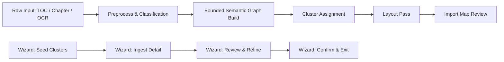

# Import Intelligence + Wizard Specification

Status: Current implementation snapshot  
Scope: Import intelligence pipeline and multi-stage wizard flow

## Brief description

Defines how raw/structured text is interpreted into process-map semantics and how the user is guided through TOC seeding, detail ingestion, review, and confirmation in the import wizard.

## Visual overview

## Scope boundaries

- Includes parser/classifier budgets, semantic graph shaping, and wizard stage transitions.
- Excludes rendering-only layout details (covered in layout spec).
- Excludes template catalog details (covered in templates spec).

## Wizard stages

Defined in UI state:

- `toc_seed`
- `detail_ingest`
- `review`
- `confirmed`

Transition intent:

1. Seed clusters from TOC lines (`Cluster: ...`).
2. Ingest detailed chapter content into seeded context.
3. Review resulting graph/map and refine manually.
4. Confirm import and continue in flow editing.

## Intelligence pipeline

1. Input normalization (OCR cleanup available).
2. Line classification (`process`, `decision`, `fact`, `policy`, `unclassified`).
3. Bounded graph construction with budgets.
4. Decision branch normalization (explicit Yes/No semantics with fallback branch support).
5. Cluster assignment from TOC seeds and stage metadata.
6. Layout pass (separate engine) for position/handle routing.

## Constraints and budgets

Current bounded defaults include limits for:

- input lines
- process nodes
- annotation nodes
- total nodes
- total edges
- per-section children
- title and note lengths

These guardrails prevent node/edge explosion and preserve readability.

## AI assist integration points

- External assist provider selector (`none`, `gemini`, `copilot`).
- Gemini proxy endpoint: `/api/gemini/assist`.
- Structured payload mode supports:
  - TOC seeding
  - detail step structuring
  - OCR cleanup

## Evidence of separation of concerns

- Content allocation/semantics are built before layout.
- Layout pass does not rewrite semantic meaning (only positions and edge handles).
- Wizard stage and import parser states are explicitly tracked in UI state.

