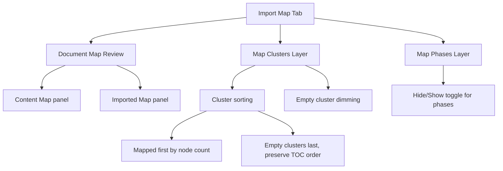

# Import Map Specification

Status: Draft (export-ready)
Scope: Import Map tab only (cluster/phase/document-map review behavior)

## Brief description

The Import Map view is the import-specific workspace used after seeding clusters and during detail ingestion/review. It prioritizes allocation transparency: seeded clusters, mapped node counts, phase visibility control, and dual document-map review panels (Content Map + Imported Map).

## Visual overview

## Functional scope

1. Cluster strip/layer:
   - Pulls seeded labels from map groups and/or cluster annotations.
   - Preserves seeded clusters even if currently unmapped (empty cluster remains visible).
   - Sort behavior:
     - mapped clusters first (descending mapped count),
     - then empty clusters,
     - tie-breaker by original seed order.
2. Map phases:
   - Import-map-only collapse/expand behavior (phase hide/show toggle).
3. Document map review:
   - Explicit section with two discoverable panels:
     - Content Map,
     - Imported Map.
   - Filter by block type (`all`, `context`, `process`, `subprocess`, `fact`, `unclassified`).
   - Coverage summary (matched/unmatched/low-confidence).

## State model (UI)

- `selectedTab = 'import_map'`
- `importMapPhasesCollapsed`
- `docMapPanelsCollapsed`
- `docMapContentFilter`
- `docMapImportedFilter`
- `docMapTargetKind` (controls upload target map type)

## Rendering model

- Clusters derive from:
  - `currentModel.projections.map.groups`,
  - annotation nodes with `Cluster:` labels.
- Mapped counts derive from non-annotation nodes by `metadata.stage`.
- Empty clusters are visually obscured (dim styling) but not removed.

## File touchpoints

- `src/App.tsx`
  - `mapClusters` derivation
  - import-map rendering blocks
  - map phases collapse toggle
  - document map review panel rendering
- `src/App.css`
  - import-map cluster chip styles
  - empty cluster/dim classes
  - document map panel styles

## Export/readiness

- Export compatible (UI/config spec).
- No canonical schema mutation required.

