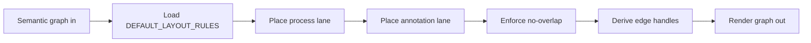

# Layout Intelligence Specification

Status: Draft  
Scope: Layout engine only (positioning + edge handle routing)  
Primary code: `v1/src/store.ts` (`DEFAULT_LAYOUT_RULES`, `enforceNoOverlap`, `deriveEdgeHandles`)

## Brief description

The layout engine is a deterministic second-pass renderer that consumes semantic nodes/edges and computes spatial placement and connector handles. It does not author semantic content.

## Responsibilities

- Position process lane nodes in a bounded row/column grid.
- Position annotation lane nodes in grouped clusters (fact/policy/unclassified).
- Resolve node collisions via explicit node-footprint overlap avoidance.
- Compute per-edge `sourceHandle` and `targetHandle` for ReactFlow.
- Preserve start/end connector direction conventions.

## Rule configuration model

All core rules live in `DEFAULT_LAYOUT_RULES`:

- `summary`: human-readable rule list.
- `nodeFootprints`: dimensions by node type.
- `process`: lane anchor + spacing + column constraints.
- `annotation`: side-lane offset + grouping spacing.
- `handleRouting`: same-row tolerance for horizontal routing.
- `overlapGuard`: padding + shift/attempt strategy.
- `decision`: decision branch behavior toggle surface.

This config-first approach is preparation for future externalized rule editing.

## Current layout decisions

- Start terminals route out from right.
- End terminals route in from left.
- Same-row flows prefer left/right handles.
- Vertical flows prefer bottom/top handles.
- Annotation nodes are offset from process lane for readability.
- Non-overlap is enforced by box intersection checks and deterministic shifts.

## Separation contract

Layout pass **must not**:

- add/remove semantic nodes,
- add/remove semantic edges,
- change edge semantic type/meaning.

Layout pass **may**:

- update node positions,
- set node `metadata.layoutGroup`,
- append layout note marker into node notes,
- set edge handle anchors.

## Visual overview

