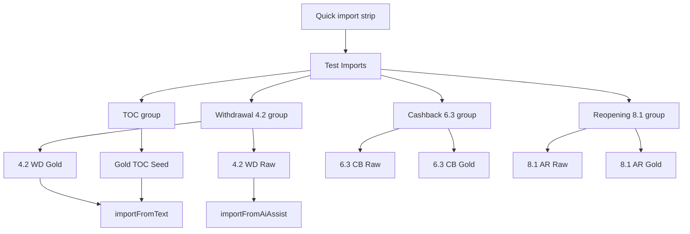

# Test Import Content and Templates Spec

Status: Active  
Scope: Template content, grouped test menu, and deterministic test fixture loading

## Brief description

This spec defines the import test content assets and how they are exposed in the UI through a compact two-layer "Test Imports" menu. The goal is repeatable scenario loading (TOC seed, raw chapter, and gold chapter variants) without cluttering the top action strip.

## Visual overview

## Content sources

Defined in `src/App.tsx`:

- `GOLD_TOC_SEED_TEMPLATE`
- `CHAPTER_WITHDRAWAL_RAW_TEMPLATE`
- `CHAPTER_WITHDRAWAL_GOLD_TEMPLATE`
- `CHAPTER_CASHBACK_RAW_TEMPLATE`
- `CHAPTER_CASHBACK_GOLD_TEMPLATE`
- `CHAPTER_REOPENING_RAW_TEMPLATE`
- `CHAPTER_REOPENING_GOLD_TEMPLATE`

Mapped into:

- `IMPORT_TEST_TEMPLATES`
- `IMPORT_TEST_TEMPLATE_GROUPS`

## Runtime behavior

1. User opens Test Imports popover.
2. User chooses scenario pill in second layer.
3. App:
   - copies payload into AI prompt box,
   - switches tab to Import Map,
   - executes import with mode-specific entrypoint (`text` or `ai`),
   - updates import stage (`toc_seed` or `detail_ingest`) and header notice.

## Current UX constraints and decisions

- Gold QA fixture buttons were removed from the top strip to keep focus on direct import testing.
- Test Imports popover z-index is raised so it cannot be blocked by the "How to build" hint.
- Clear button remains available in primary strip to reset current version rapidly.

## Export considerations

The template bundle is export-ready as structured text constants and can be externalized later:

- JSON seed pack (template id, label, mode, payload)
- optional markdown companion with narrative guidance

## Future extension points

- Add import template editor (CRUD) with persistence.
- Bind templates to evaluation presets (without re-cluttering top strip).
- Attach confidence baselines and expected graph signatures per template.

